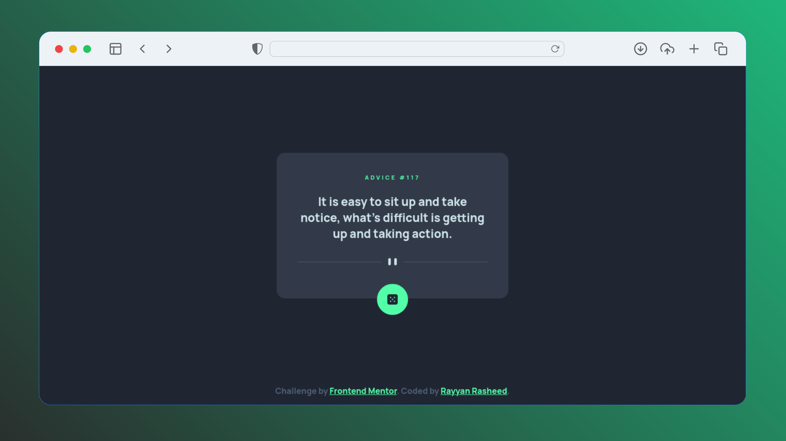

# Frontend Mentor - Advice generator app solution

This is a solution to the [Advice generator app challenge on Frontend Mentor](https://www.frontendmentor.io/challenges/advice-generator-app-QdUG-13db). Frontend Mentor challenges help you improve your coding skills by building realistic projects.

## Table of contents

- [Overview](#overview)
  - [Screenshot](#screenshot)
  - [Links](#links)
- [My process](#my-process)
  - [Built with](#built-with)
- [Author](#author)

## Overview

### Screenshot

### Links

- Live Site URL: [Advice generator app](https://rayyanrnkj.github.io/Advice-generator-app/)
- Solution URL: [Advice generator app solution](https://www.frontendmentor.io/solutions/advice-generator-app-solution-made-with-html-css-js-api-RpXv5glqYf)

## My process

### Built with

- HTML5
- CSS3
- JS, ES6 +
- [Advice Slip JSON API](https://api.adviceslip.com/)
- Google Fonts

## Author

- Frontend Mentor - [@RayyanRNKJ](https://www.frontendmentor.io/profile/RayyanRNKJ)
- Linkedin - [Rayyan Rasheed](https://www.linkedin.com/in/rayyan-rasheed-2623b41b3/)
- Linktree - [RayyanRNKJ](https://linktr.ee/rayyanrnkj)
